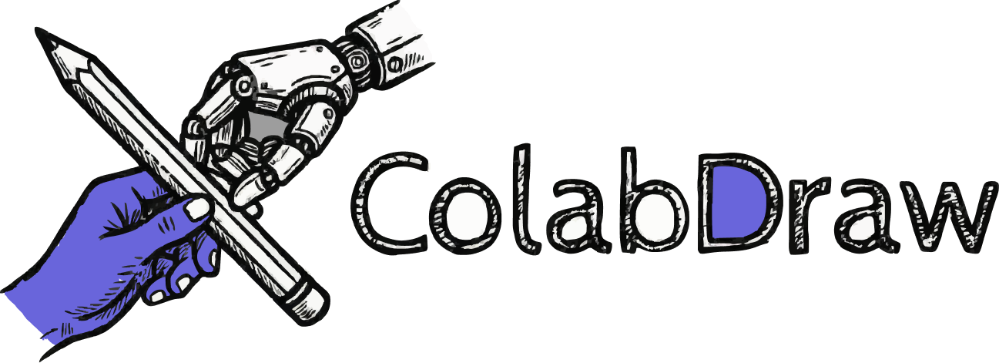

<div align="center">
  
  
  <h1>ColabDraw</h1>
  
  <p>
    <strong>An open source collaborative virtual whiteboard</strong><br/>
    Hand-drawn style • Real-time collaboration • End-to-end encrypted
  </p>

  <!-- Badges -->
  <p>
    <a href="https://github.com/JyotirmoyDas05/ColabDraw/blob/master/LICENSE">
      
    </a>
    <a href="https://github.com/JyotirmoyDas05/ColabDraw">
      
    </a>
    <a href="https://github.com/JyotirmoyDas05/ColabDraw/fork">
      
    </a>
  </p>

  <p>
    
    
    
    
    
  </p>

  <p>
    <a href="https://github.com/JyotirmoyDas05/ColabDraw/issues">
      
    </a>
    <a href="https://github.com/JyotirmoyDas05/ColabDraw/pulls">
      
    </a>
    <a href="https://github.com/JyotirmoyDas05/ColabDraw/graphs/contributors">
      
    </a>
    
  </p>

  <p>
    
    
    
  </p>

---

</div>

> [!NOTE] > **ColabDraw** has taken some Components from [Excalidraw](https://github.com/excalidraw/excalidraw), and Fully Customized it according to the Project Author's Likings and is currently Maintained by JyotirmoyDas05. This project maintains the MIT license and includes all original copyright attributions as required.

## Features

The ColabDraw editor supports:

- 💯 Free & open-source
- 🎨 Infinite, canvas-based whiteboard
- ✍️ Hand-drawn like style
- 🌓 Dark mode
- 🏗️ Customizable
- 📷 Image support
- 😀 Shape libraries support
- 🌐 Localization (i18n) support
- 🖼️ Export to PNG, SVG & clipboard
- 💾 Open format - export drawings as an `.excalidraw` json file
- ⚒️ Wide range of tools - rectangle, circle, diamond, arrow, line, free-draw, eraser...
- ➡️ Arrow-binding & labeled arrows
- 🔙 Undo / Redo
- 🔍 Zoom and panning support

## ColabDraw App Features

- 📡 PWA support (works offline)
- 🤼 Real-time collaboration
- 🔒 End-to-end encryption
- 💾 Local-first support (autosaves to the browser)
- 🔗 Shareable links

## Development

### Prerequisites

- Node.js >= 18.0.0
- Yarn 1.22.22

### Quick Start

```bash
# Install dependencies
yarn install

# Configure environment variables
cp .env.development.example .env.development
# Edit .env.development with your Appwrite credentials

# Start development server
yarn start

# Build for production
yarn build
```

### Available Scripts

- `yarn start` - Start development server
- `yarn build` - Build for production
- `yarn test` - Run tests
- `yarn test:coverage` - Run tests with coverage
- `yarn fix` - Auto-fix linting and formatting issues

## Building & Deployment

### Local Development

```bash
yarn start
```

The app will be available at `http://localhost:3000`

### Production Build

```bash
yarn build:app
```

### Docker

```bash
# Build Docker image
docker build -t colabdraw .

# Run Docker container
docker run -p 80:80 colabdraw
```

## Technology Stack

- **Frontend**: React 19 with TypeScript
- **Build Tool**: Vite
- **State Management**: Jotai
- **Real-time Communication**: Socket.io
- **Backend**: Appwrite (for collaboration and storage)

## Project Structure

```
ColabDraw/
├── excalidraw-app/     # Main application
├── packages/
│   ├── excalidraw/     # Core drawing library
│   ├── math/           # Math utilities
│   ├── element/        # Element handling
│   ├── utils/          # Shared utilities
│   └── common/         # Common packages
├── examples/           # Example integrations
└── public/             # Static assets
```

## Translation

ColabDraw supports multiple languages through the i18n system. Translation files are located in `packages/excalidraw/locales/`.

The project uses [Crowdin](https://crowdin.com) for translation management, which offers free services for open-source projects.

## Monitoring (Future)

This project is configured to support [Uptime Kuma](https://github.com/louislam/uptime-kuma), a self-hosted monitoring solution. Setup instructions will be provided when deploying to production.

## Contributing

Contributions are welcome! Please feel free to submit issues or pull requests.

1. Fork the repository
2. Create your feature branch (`git checkout -b feature/amazing-feature`)
3. Commit your changes (`git commit -m 'Add some amazing feature'`)
4. Push to the branch (`git push origin feature/amazing-feature`)
5. Open a Pull Request

## License

This project is licensed under the MIT License - see the [LICENSE](LICENSE) file for details.

### Attribution

ColabDraw has taken some Components from[Excalidraw](https://github.com/excalidraw/excalidraw):

- Copyright (c) 2020 Excalidraw
- Copyright (c) 2025 JyotirmoyDas05 (ColabDraw modifications)

## Acknowledgments

- Original Excalidraw team and contributors (for their Great Components and Documentation)
- All open-source libraries used in this project
